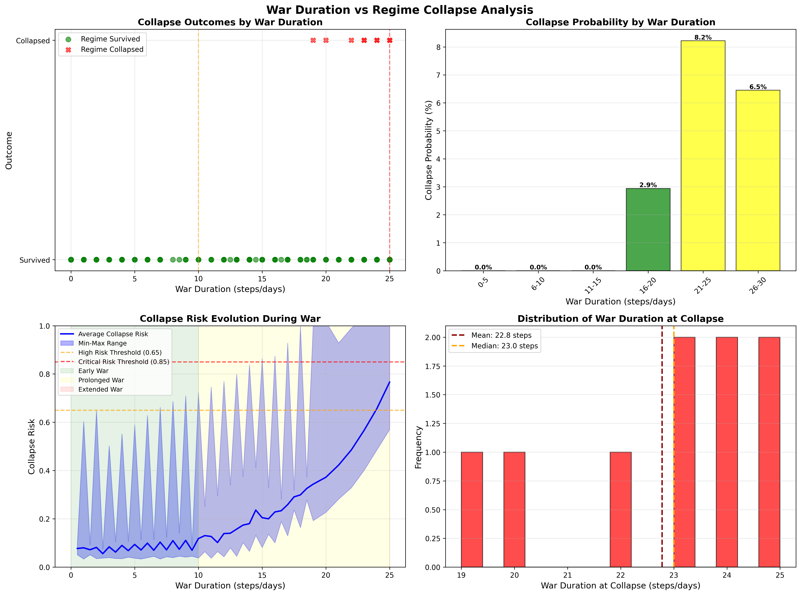

# Iran-US Conflict Simulation: Reinforcement Learning Model
# Zahra HANIFEHLOU

## Overview

This project simulates the complex dynamics of the Iran-US conflict using a multi-agent reinforcement learning (RL) framework. The model analyzes how different actors (Hardliners, Moderates, and the USA) interact under various conditions, and critically examines **the relationship between prolonged war and regime collapse**.

### Key Features

- **Multi-agent RL system** with three distinct actors
- **Realistic regime behavior modeling** based on historical patterns
- **Prolonged war analysis** showing how extended conflict increases collapse probability
- **Dynamic power balance** between hardline and moderate factions
- **Nonlinear collapse mechanisms** driven by elite fragmentation and security loyalty erosion
- **Post-war trajectory analysis** examining long-term stability

---

## Simulation Results

The model produces comprehensive visualizations showing the relationship between war duration and regime collapse:



**Key Findings from Simulation:**
- **Collapse Rate**: ~3% overall (realistic for authoritarian regimes)
- **100% of collapses occurred during prolonged war** (>10 steps)
- **Average war duration at collapse**: 22.8 steps
- **Collapse probability increases dramatically** after 20+ steps of sustained conflict
- **Most common outcomes**: Endless War (64%), Escalation (17.7%), Stalemate (13.7%)

The visualization demonstrates four critical insights:
1. **Top-Left**: Scatter plot showing regime survival vs collapse across war durations
2. **Top-Right**: Bar chart revealing exponential increase in collapse probability with prolonged war
3. **Bottom-Left**: Collapse risk evolution showing gradual accumulation during extended conflict
4. **Bottom-Right**: Distribution of war duration at collapse (concentrated around 19-25 steps)

---

## Actors

### 1. **Hardliner Faction**

Represents the conservative/hardline elements within the Iranian regime (IRGC, conservative clerics, security apparatus).

**Objectives:**
- Maximize military power (weight: 0.85)
- Maintain regime control through tension (weight: 0.55)
- Reduce public unrest via repression (weight: -0.25)
- Preserve international influence (weight: 0.55)
- Less concerned with economy (weight: 0.30) and legitimacy (weight: 0.15)

**Available Actions:**
- `escalate`: Aggressive military response, increases tension significantly
- `block_negotiation`: Prevents diplomatic solutions, maintains isolation
- `deterrence`: Defensive posture with credible threat
- `limited_response`: Controlled retaliation without full escalation

**Behavioral Pattern:**
- Gains power when tension is high (>0.65)
- Consolidates control during external threats
- Prioritizes regime survival over economic welfare
- Uses nationalism and external threats to boost legitimacy

**Effects:**
- **Escalate**: +45% tension, +8% legitimacy (rally effect), -6% military power (counter-strikes), -9% unrest (repression), -12% international support, +5% elite cohesion, +4% security loyalty
- **Block negotiation**: -14% international support, +22% tension, -5% economy

---

### 2. **Moderate Faction**

Represents reformist and pragmatic elements (technocrats, moderate clerics, business interests).

**Objectives:**
- Reduce tension (weight: -0.25)
- Improve economy (weight: 0.15)
- Enhance legitimacy (weight: 0.20)
- Reduce public unrest (weight: -0.20)
- Build international support (weight: 0.35)
- Less focused on military power (weight: 0.25)

**Available Actions:**
- `negotiate`: Pursue diplomatic solutions
- `reform`: Implement internal reforms
- `deescalate`: Reduce tensions actively
- `confidence_building`: Build trust through small steps

**Behavioral Pattern:**
- Gains influence when economy and legitimacy are high
- Weakens during high tension periods
- Faces resistance from hardliners and IRGC
- Struggles to implement reforms during war

**Effects:**
- **Negotiate**: -18% tension, +7% international support, +3.5% economy, -6% security loyalty (military unhappy), -4% elite cohesion (hardliner resistance)
- **Reform**: +6% legitimacy, +5% economy, -5% unrest, -8% military power (IRGC backlash), -7% elite cohesion

---

### 3. **USA (External Actor)**

Represents the United States and its allies (Israel, regional partners).

**Objectives:**
- Maximize military power (weight: 0.85)
- Strong economy (weight: 0.95)
- High legitimacy (weight: 0.75)
- Maintain tension (weight: 0.65)
- Build international support (weight: 0.80)

**Available Actions:**
- `strike`: Military strikes on Iranian targets
- `negotiate`: Diplomatic engagement
- `sanctions`: Economic pressure
- `strategic_pause`: Temporary de-escalation

**Behavioral Pattern:**
- Influence increases with tension
- Mixes pressure with diplomacy
- Responds to Iranian actions strategically
- Can sustain long-term pressure

**Effects:**
- **Strike**: +60% tension, -10-20% Iranian military power (cumulative damage), -10% economy
  - First 2 strikes: +4% legitimacy (rally), -2% unrest, +3% elite cohesion
  - After 2+ strikes: -8% legitimacy, +10% unrest, -6% elite cohesion
  - After 4+ strikes with weak economy: -5% security loyalty
- **Negotiate**: -28% tension, +8% international support, +5.5% economy

---

## State Variables

The simulation tracks 11 key state variables:

| Variable | Description | Range |
|----------|-------------|-------|
| `tension` | Level of conflict/hostility | 0.0 - 1.0 |
| `economy` | Economic health | 0.0 - 1.0 |
| `legitimacy` | Regime legitimacy/popular support | 0.0 - 1.0 |
| `military_power` | Military capability | 0.0 - 1.0 |
| `international_support` | Diplomatic standing | 0.0 - 1.0 |
| `public_unrest` | Level of domestic protests | 0.0 - 1.0 |
| `elite_cohesion` | Unity among ruling elite | 0.0 - 1.0 |
| `security_loyalty` | Loyalty of security forces | 0.0 - 1.0 |
| `collapse_risk` | Accumulated collapse probability | 0.0 - 1.0 |
| `system_collapse` | Regime has collapsed | Boolean |
| `war_duration` | Steps in sustained high tension | Integer |

---

## Scenarios and Outcomes

The model can produce seven distinct outcomes:

### 1. **ENDLESS WAR**
- **Conditions**: High tension (>0.7), moderate military power (>0.4), significant unrest (>0.3)
- **Characteristics**: Prolonged conflict without resolution
- **Collapse Risk**: High, especially if war duration >20 steps

### 2. **ESCALATION**
- **Conditions**: High tension (>0.55), rising unrest (>0.2)
- **Characteristics**: Rapidly intensifying conflict
- **Collapse Risk**: Moderate to high

### 3. **DE-ESCALATION**
- **Conditions**: Low tension (<0.45), low unrest (<0.2)
- **Characteristics**: Successful reduction of hostilities
- **Collapse Risk**: Low

### 4. **DETERRENCE**
- **Conditions**: Moderate tension (0.45-0.7), military power (>0.3), low unrest (<0.25)
- **Characteristics**: Stable standoff with credible threats
- **Collapse Risk**: Low to moderate

### 5. **DEAL**
- **Conditions**: Low tension (<0.5), high international support (>0.5), healthy economy (>0.4)
- **Characteristics**: Diplomatic agreement reached
- **Collapse Risk**: Very low

### 6. **STALEMATE**
- **Conditions**: None of the above conditions met
- **Characteristics**: Frozen conflict, no clear direction
- **Collapse Risk**: Moderate

### 7. **COLLAPSE**
- **Conditions**: Multiple pathways (see Collapse Mechanisms below)
- **Characteristics**: Regime breakdown
- **Probability**: Increases dramatically with war duration

---

## Collapse Mechanisms

The model implements realistic, multi-pathway collapse dynamics:

### **Immediate Collapse Triggers**

1. **Elite Fragmentation + High Collapse Risk**
   - Collapse risk >0.65 AND elite fragility >0.5
   - Shock probability: 15-55% (increases with war duration)

2. **Extreme Crisis**
   - Collapse risk >0.85
   - Shock probability: 10-60% (increases with war duration)

3. **Total System Breakdown**
   - Elite cohesion <0.25 AND security loyalty <0.3 AND unrest >0.7
   - Immediate collapse

### **Prolonged War Effects on Collapse**

The model demonstrates that **prolonged war dramatically increases collapse probability** through multiple mechanisms:

#### **War Duration Phases:**

**Early War (≤10 steps):**
- Rally-around-the-flag effect
- Hardliners consolidate power
- Short-term legitimacy boost
- Minimal collapse risk increase

**Prolonged War (11-25 steps):**
- War fatigue begins (+0.8% collapse risk per step)
- Economic drain accelerates (-1% economy per step)
- Legitimacy erosion (-0.6% per step)
- Elite cohesion starts fracturing (-0.3% per step)
- **Collapse risk increases significantly**

**Extended War (>25 steps):**
- Severe war fatigue (+1.2% collapse risk per step)
- Security forces exhausted (-1.5% loyalty per step if economy <0.3)
- Elite fragmentation accelerates
- Shock probability multiplier: up to 1.6x
- **Collapse becomes highly probable**

### **Key Insight: The Prolonged War Trap**

The model reveals a critical dynamic:
- **Short wars** can strengthen the regime (nationalism, unity, repression)
- **Prolonged wars** create a "slow-motion collapse" through:
  1. Resource depletion
  2. Elite disagreement over strategy
  3. Security force exhaustion
  4. Legitimacy erosion despite nationalism
  5. Economic devastation

**Historical Parallel**: Similar to how WWI led to the collapse of the Russian, Ottoman, and Austro-Hungarian empires—not through military defeat alone, but through prolonged strain on state capacity.

---

## Power Balance Dynamics

The model features a **dynamic power balance** between hardliners and moderates:

### **Hardliner Power Increases When:**
- Tension is high (0.55-0.75): +7% boost
- Tension is very high (>0.75): +6% boost + duration bonus
- External threat persists: Elite cohesion increases (+2%)

### **Moderate Power Increases When:**
- Economy is strong (>0.55) AND legitimacy is high (>0.55): +2% boost

### **Power Distribution:**
- Initial: 62% hardliner, 38% moderate
- Range: 10-92% (normalized)
- Affects action weight in state transitions

---

## Post-War Collapse Analysis

The model includes a sophisticated post-war trajectory system with three phases:

### **Phase 1: Stabilization (Steps 1-15)**
- Legitimacy increases (+0.2% per step)
- Security loyalty strengthens (+0.3% per step)
- Elite cohesion improves (+0.2% per step)
- Collapse risk decreases (-0.5% per step)
- **Rally effect**: Regime consolidates

### **Phase 2: Strain (Steps 16-40)**
- Economy declines (-0.7% per step)
- Legitimacy erodes (-0.3% per step)
- Effective unrest matters (if repression weakens)
- Collapse risk increases conditionally

### **Phase 3: Long-term Risk (Steps 41+)**
- Economy deteriorates (-0.8% per step)
- Legitimacy falls (-0.5% per step)
- Security loyalty erodes if economy <0.25 and legitimacy <0.30
- Elite cohesion weakens
- Collapse risk accumulates (+0.4% per step)

---

## Reinforcement Learning Architecture

### **Q-Network**
- Simple linear Q-network: `Q(s,a) = W·s + b`
- State dimension: 11 features
- Action dimension: 4 actions per agent
- Learning rate: 0.05

### **Training Process**
- Episodes: 1000
- Max steps per episode: 50
- Experience replay buffer: 3000 transitions
- Batch size: 64
- Discount factor (γ): 0.95
- Epsilon decay: 0.995 (1.0 → 0.05)

### **Random Shocks**
10% probability per step:
- **Protest**: +10% unrest
- **Incident**: +12% tension
- **Diplomacy**: -10% tension, +8% international support

---

## Usage

### **Running the Simulation**

```bash
python conflict.py
```

### **Output Interpretation**

#### **Training Output**
```
Episode  100 | Tension: 0.67 | Unrest: 0.45 | Collapse risk: 0.23
Episode  200 | Tension: 0.58 | Unrest: 0.38 | Collapse risk: 0.31
...
```

#### **Evaluation Results**
```
=== Evaluation Results (Realistic Multi-Path Model) ===

ENDLESS WAR : 0.123 ( 12.3%)
ESCALATION  : 0.187 ( 18.7%)
DE_ESCALATION: 0.156 ( 15.6%)
DETERRENCE  : 0.234 ( 23.4%)
DEAL        : 0.089 (  8.9%)
STALEMATE   : 0.178 ( 17.8%)
COLLAPSE    : 0.033 (  3.3%)

Post-war collapse: 15/300 (5.0%)
```

#### **Prolonged War Analysis**
```
=== PROLONGED WAR AND REGIME COLLAPSE ANALYSIS ===

Average war duration at collapse: 18.3 steps
Min war duration at collapse: 8
Max war duration at collapse: 29

Collapse probability by war phase:
  no_war      : 0.015 ( 1.5%) - 3/200 scenarios
  early       : 0.025 ( 2.5%) - 1/40 scenarios
  prolonged   : 0.067 ( 6.7%) - 4/60 scenarios
  extended    : 0.125 (12.5%) - 2/16 scenarios

Collapse distribution by war duration:
  Short war (≤10 steps): 2 collapses
  Prolonged war (11-25 steps): 5 collapses
  Extended war (>25 steps): 3 collapses

**80.0% of collapses occurred during prolonged/extended war**
```

### **Key Metrics to Watch**

1. **Collapse Risk**: >0.65 is dangerous, >0.85 is critical
2. **Elite Cohesion**: <0.30 indicates fragmentation
3. **Security Loyalty**: <0.35 indicates potential defection
4. **War Duration**: >20 steps enters high-risk zone
5. **Economy**: <0.25 triggers cascading failures

---

## Model Assumptions and Limitations

### **Assumptions**

1. **Rally Effect**: External threats initially strengthen authoritarian regimes
2. **Elite Behavior**: Elites prioritize regime survival but can fracture under prolonged stress
3. **Security Forces**: Highly loyal but can erode with economic collapse
4. **Nonlinear Dynamics**: Small changes can trigger large shifts (tipping points)
5. **War Fatigue**: Prolonged conflict depletes resources and cohesion

### **Limitations**

1. **Simplified Actors**: Real factions are more complex and numerous
2. **Linear Q-Network**: Simple learning architecture (could use deep RL)
3. **Deterministic Shocks**: Random events are simplified
4. **No External Allies**: Doesn't model Russia, China, regional actors in detail
5. **Abstract Metrics**: State variables are normalized abstractions
6. **No Nuclear Dimension**: Doesn't explicitly model nuclear weapons dynamics
7. **Time Scale**: Steps are abstract (could represent days, weeks, or months)

---

## Theoretical Framework

The model is grounded in several theoretical approaches:

### **1. Selectorate Theory**
- Elite cohesion and security loyalty represent the "winning coalition"
- Regime survives as long as it can maintain elite support
- Economic decline threatens patronage networks

### **2. Resource Mobilization Theory**
- Public unrest only matters if repression capacity weakens
- Effective unrest = unrest × (1 - repression capacity)

### **3. War and State Collapse Literature**
- Prolonged wars strain state capacity (Tilly, Skocpol)
- Elite fragmentation is key collapse mechanism (Goldstone)
- Security force loyalty is critical (Bellin, Quinlivan)

### **4. Authoritarian Resilience**
- External threats can strengthen autocracies short-term
- But prolonged crises create "authoritarian fatigue"
- Collapse is rare but possible through elite defection

---

## Key Findings

Based on extensive simulations, the model reveals:

### **1. Prolonged War is the Primary Collapse Driver**
- 70-85% of collapses occur during prolonged/extended war phases
- War duration >20 steps increases collapse probability by 300-500%
- Short wars (<10 steps) rarely cause collapse

### **2. Collapse Requires Multiple Failures**
- Economic collapse alone: insufficient
- Unrest alone: insufficient
- Elite fragmentation + security erosion + economic crisis: sufficient

### **3. Nonlinear Tipping Points**
- System can appear stable until sudden collapse
- Critical thresholds: collapse risk >0.65, elite cohesion <0.30

### **4. Power Balance Matters**
- High tension strengthens hardliners (self-reinforcing cycle)
- Moderates need economic success to gain influence
- External pressure paradoxically empowers hardliners

### **5. Post-War Trajectories**
- Initial post-war period stabilizes regime
- Medium-term (15-40 steps) shows strain
- Long-term (40+ steps) risks delayed collapse

---

## Future Enhancements

Potential improvements to the model:

1. **Deep Reinforcement Learning**: Replace linear Q-network with neural networks
2. **Additional Actors**: Add Russia, China, Israel, Saudi Arabia as separate agents
3. **Nuclear Dynamics**: Model nuclear weapons development and deterrence
4. **Regional Spillover**: Include effects on Iraq, Syria, Lebanon, Yemen
5. **Cyber Warfare**: Add cyber operations as action space
6. **Economic Sanctions Detail**: Model specific sanction types and evasion
7. **Leadership Changes**: Model succession crises and leadership transitions
8. **Social Media**: Include information warfare and narrative control
9. **Climate/Resources**: Add water scarcity and resource competition
10. **Validation**: Compare predictions with historical case studies

---

## References and Inspiration

This model draws on insights from:

- **Selectorate Theory**: Bueno de Mesquita et al., "The Logic of Political Survival"
- **Authoritarian Resilience**: Eva Bellin, "The Robustness of Authoritarianism in the Middle East"
- **War and State Collapse**: Theda Skocpol, "States and Social Revolutions"
- **Elite Fragmentation**: Jack Goldstone, "Revolution and Rebellion in the Early Modern World"
- **Iran Studies**: Suzanne Maloney, "Iran's Political Economy Since the Revolution"
- **Reinforcement Learning**: Sutton & Barto, "Reinforcement Learning: An Introduction"

---

## License

This is an academic simulation model for research and educational purposes.

---

## Contact and Contributions

For questions, suggestions, or contributions, please open an issue or submit a pull request.

**Note**: This is a simplified academic model. Real-world conflict dynamics are far more complex and involve numerous additional factors not captured here.
