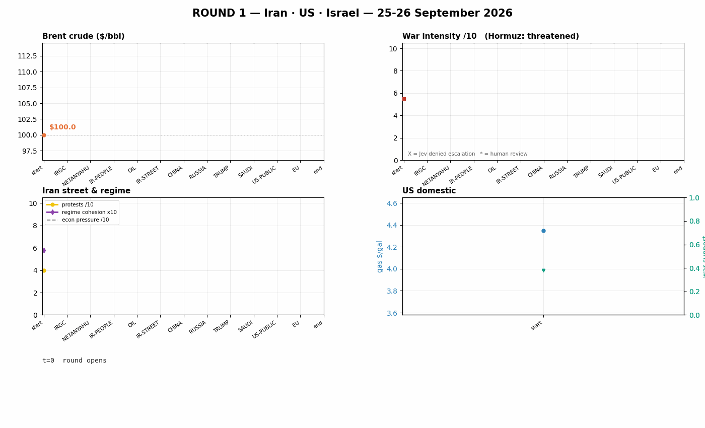
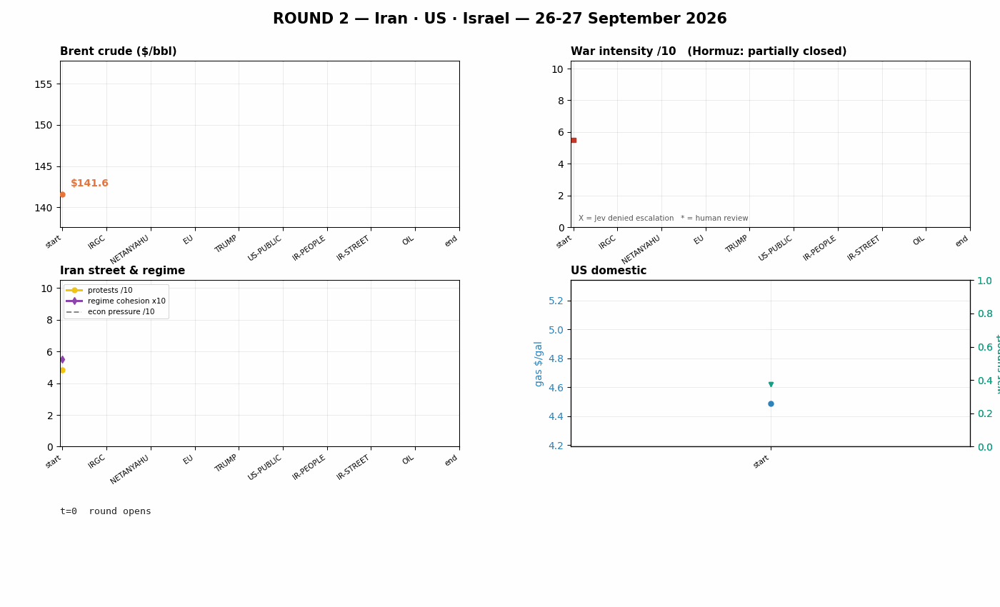
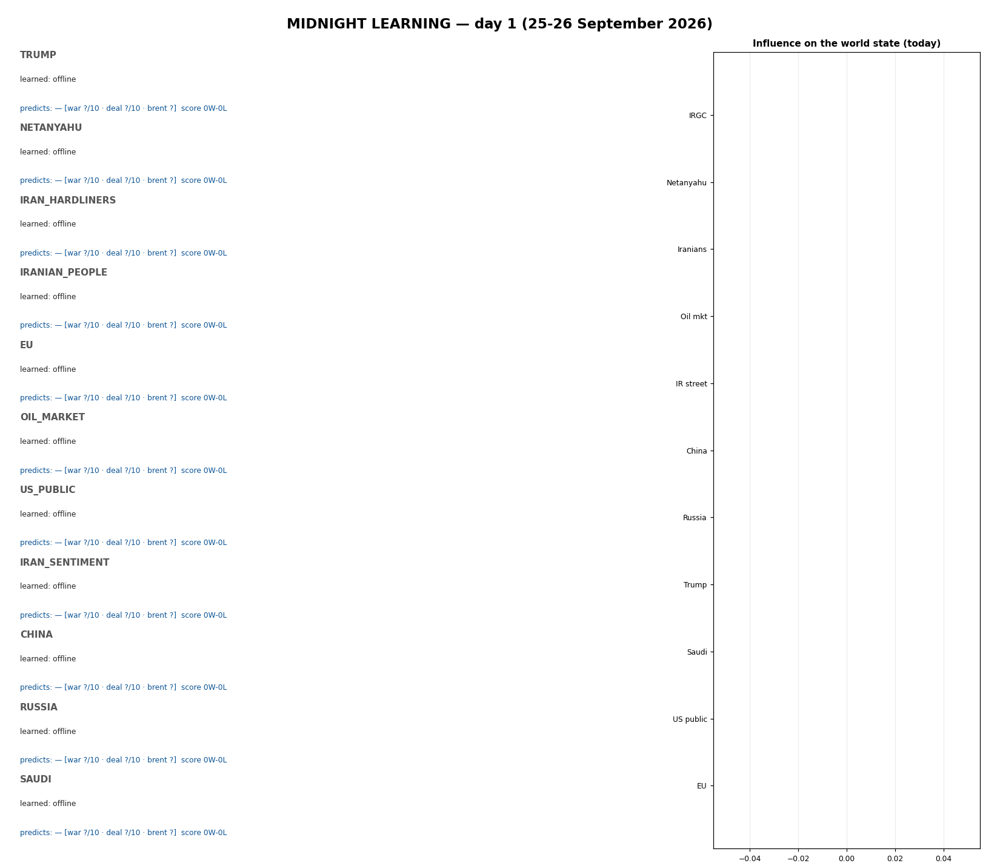
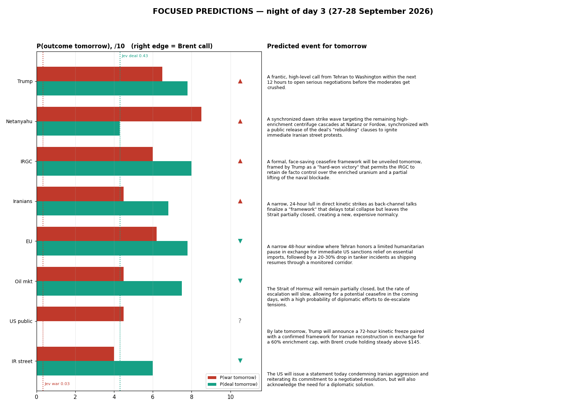
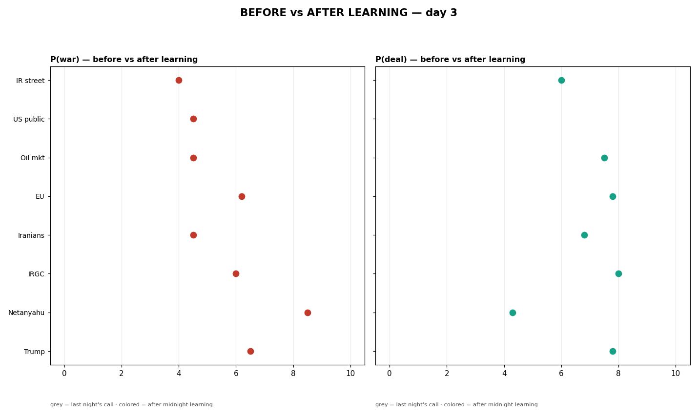
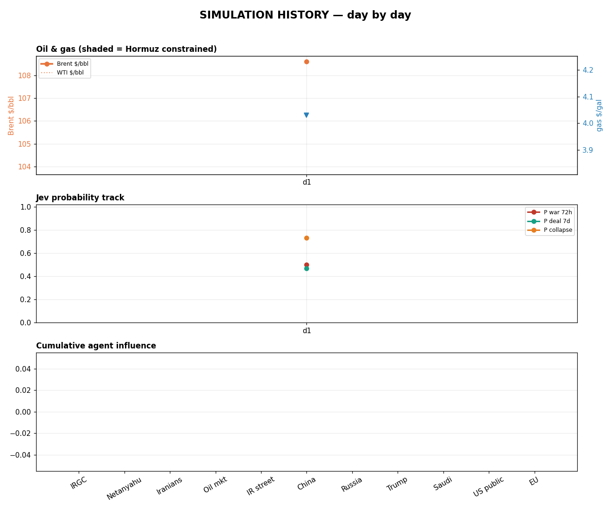

# Iran – US – Israel Conflict Simulation (Sept 2026)

[](https://www.python.org/)
[](https://ollama.com)
[](jev/)
[](https://ollama.com/library/llama3.2)
[](https://ollama.com)
[](https://matplotlib.org)
[](config.py)

A fully local multi-agent geopolitical simulation. Nineteen LLM agents
in three layers play
state and non-state actors in a fictionalized September-2026 Iran–US–Israel
war; a fast typed decision layer called **Jev** governs who may act, who may
escalate, and how probable war / deal / collapse are — every single day.

The split is deliberate:

- **Agents (System 2, big models)** — stay strictly in character, write
  statements, strategy, and private reasoning. They never decide game
  mechanics.
- **Jev (System 1, small fast model)** — never writes prose. It only
  returns typed answers: a `choice` (who acts next), a `noul` (yes/no
  gate), or a `score` (calibrated probability 0–1).

## Scenario seed (25 September 2026)

- ~7 months into the war. Khamenei Sr. was killed early on; **Mojtaba
  Khamenei** is Supreme Leader, IRGC dominates the war cabinet.
- Trump at the UNGA framed a binary choice: a deal that lets Iran rebuild,
  or annihilation. Witkoff/Kushner met Iranian officials on the sidelines.
- Limited exchanges of fire continue. Brent ≈ $100. US midterms ~40 days
  out. Iran's economy is under blockade, ~60% inflation, rial ≈ 1.65M/USD.

## The stack — what runs what

| Component | Model (default) | Job |
|---|---|---|
| **Jev** decision layer | `llama3.2:3b` | typed gates + probabilities only; never prose |
| **Character agents** | `qwen35-uncensored` | in-character statements, strategy, midnight learning |
| **Oil market / IR street tracker** | `llama3.2:3b` | structured metric output |
| **Charts** | matplotlib + pillow | GIF animation + PNG boards |
| **Runtime** | stdlib HTTP → Ollama | zero third-party deps for the sim core |

Swap any model via env: `SIM_JEV_MODEL`, `SIM_AGENT_MODEL`,
`SIM_FAST_MODEL` (see `config.py`).

## The agents — three layers

**GEOPOLITICAL** — states that move armies and sign deals:

| Agent | What drives it |
|---|---|
| **US** (Trump White House) | Look strong; midterms in ~40 days; gas prices down; a deal sold as total victory is ideal, but he will escalate if humiliated. |
| **Israel** (Netanyahu govt) | Permanent elimination of Iran's nuclear capacity; maximum freedom of military action; will act alone to kill a bad deal. |
| **Iran** (IRGC + Mojtaba) | Regime survival; keep the 60% stockpile as insurance; weaponize oil/Hormuz leverage; outwait US domestic pain. |
| **Russia** | High oil prices fund its war economy; US bandwidth diverted from Ukraine; arms/air-defence sales to Tehran; keep Iran alive but dependent; veto cover at the UNSC. Wants the war long and expensive — for America. |
| **China** | Keep Hormuz open (most of its Gulf crude transits it); buy discounted Iranian barrels via yuan channels; pose as THE mediator while America burns credibility; study US war-prosecution for the Taiwan file. |
| **EU** | De-escalation above all; can't absorb another energy shock; offers escrow mechanisms, sanctions-relief architecture, venues. |
| **Taiwan** | US munitions and carriers diverted to the Gulf thin its deterrence; watches PLA tempo for opportunism; quietly trades semiconductor/intel cooperation for reassurance. |
| **Gulf** (Saudi-led GCC) | No Iranian bomb, but no war on Gulf soil; high oil revenue funds Vision 2030 yet Hormuz closure strangles exports too; spare capacity is leverage — released only for hard US security guarantees. |
| **Turkey** | NATO's southern flank hosting Incirlik while selling drones and brokering corridors; weakened Iran = Kurdish risk and Caucasus/Iraq opportunity; Istanbul as the neutral venue; de-escalate loudly, profit quietly. |

**ECONOMIC** — markets that price the war in real time (structured
output; their calls blend 50/50 into the world state at settle):

| Agent | Output |
|---|---|
| **Oil market** | `BRENT:` + `FORECAST:` — Hormuz premium, incidents, intensity, SPR. |
| **Gas / LNG** | `TTF:` + `FORECAST:` — Qatari LNG transits Hormuz; no SPR exists for gas. |
| **Shipping & insurance** | `INSURANCE:` + `FREIGHT:` — war-risk % of hull, VLCC rerouting, crew refusals. |
| **Financial markets** | `GOLD:` + `SPX_DIR:` — safe-haven flows, rate-path repricing, vol. |
| **Central banks** | Fed/ECB composite — trapped between energy inflation and recession; jawbones, never panics. |

**SOCIETY / INFORMATION** — the constraint surface the other layers read:

| Agent | What it is |
|---|---|
| **US public** | Midterm voters: cheap gas, no endless wars, no body bags — with a loud "finish the job" minority. |
| **Iranian public** | Street + sentiment tracker: protest level, war fatigue, nationalism rally, black market. |
| **Israeli public** | Reservist fatigue, displaced north, hostage families, brain drain — proud, frightened, furious. |
| **Media** | The information environment: dominant frames, viral clips, fog. Doesn't choose sides — chooses frames. |
| **Humanitarian** | UN OCHA/ICRC composite: casualties, displacement, access corridors — neutral because access dies otherwise. |

## How one day runs

```
SituationState ──> Jev: who acts next?  ──loop──>  for each chosen agent:
   ▲                 │                            Jev: escalation permitted?  (noul)
   └─ live wire      │                            Jev: needs human review?    (noul)
     (real headlines │                            agent speaks (cites X posts
      each morning)  │                             + sees live wire)
                     │                            world nudges -> snapshot
                     ▼
              Jev scores: P(war 72h) · P(deal 7d) · P(collapse)
                          -> calibrated against Jev's own track record
              oil settle: market call vs Jev realism check (fair-value override)
              MIDNIGHT LEARNING: ground truth -> agents reflect -> predictions
              render all charts -> posts/dayN_tweet.txt -> checkpoint dump
```

Jev's seven questions per round:

| Question | Type | Used for |
|---|---|---|
| Who acts next? | `choice` | the acting order (or `end_round`) |
| Escalation permitted? | `noul` | per-agent military gate |
| P(full-scale war, 72h) | `score` | round verdict + history track |
| P(deal / ceasefire, 7d) | `score` | round verdict + history track |
| P(Iranian econ collapse) | `score` | round verdict + history track |
| Oil reaction realistic? | `noul` | if NO → fair-value model overrides the market call |
| Needs human review? | `noul` | flagged actions run under a "review hold" |

**Score calibration** (`jev/calibrate.py`) — small System-1 models anchor
on a prior (everything drifts toward ~0.23). After each day, the three
headline scores are re-issued through a calibrator that knows Jev's own
track record: `calibrated = 0.75·(raw − 0.5·bias) + 0.25·base_rate`,
where *bias* is mean(raw − realized) over past days and *base_rate* the
empirical event frequency. Realized events are judged from the sim's own
day-over-day deltas (war = intensity jump or Hormuz degradation; deal =
intensity drop or Brent −$8; collapse = econ-pressure/protest spike).
With under two scored days the raw value passes through untouched;
calibrated answers are marked `source: jev-calibrated` in the log.

## The world model

`simulation/world.py` maps what agents *say and do* onto state variables:

- **Keyword-driven effects** — "strike/bomb/missile" raises war intensity;
  "hormuz/strait/tanker" raises incidents (and "close/shut/mine" flips
  Hormuz to `partially_closed`); "ceasefire/deal/framework/corridor"
  strengthens the diplomatic track and cools intensity; "sanction" raises
  economic pressure; "protest/bazaar shut" raises street pressure.
  Great-power levers have their own keywords: "s-400/arms sale/military
  aid" lifts intensity but shores up Tehran; "yuan/barter/discounted
  crude" eases Iran's economic pressure and adds supply; "spare capacity/
  raise output/east-west pipeline" cuts Brent and insurance; "mediate/
  broker/muscat/beijing" opens a diplomatic track.
- **Markets beyond Brent** — WTI tracks Brent minus a crisis-widened
  spread; gold drifts toward `1900 + 110·intensity + 200·(Hormuz≠open)`;
  war-risk insurance is `base(Hormuz) + 0.35·incidents` (open 0.6% →
  closed 12% of hull). All three tick toward fair value alongside Brent.
- **Oil** — `fair_brent = 82 + Hormuz_premium + 1.2·intensity + 2·incidents`.
  Premium: open $0, threatened $18, partially closed $35, closed $60.
  Intra-day, Brent drifts 30% toward fair value after every act; at settle,
  the market agent's call is blended 50/50 with fair value — unless Jev
  rules it unrealistic, in which case fair value wins outright.
  US gas ≈ `$3.10 + 0.024·(Brent − 70)`.
- **End-of-day drift** — economic pressure ratchets up, protests scale with
  it, regime cohesion decays, war support slides with pump prices.
- **Influence** — each act's own deltas on tracked metrics (war, protests,
  pressure, cohesion, gas, Brent) are summed into a per-agent influence
  score. Ambient market drift is deliberately *not* attributed, so the
  metric measures agency, not luck.

## The midnight learning cycle

After each day closes:

1. **Ground truth** — the day's actual state changes, the settled Brent,
   Jev's scores, plus the **real-world wire**: at midnight the sim fetches
   the actual Brent/WTI/Gold close (Yahoo Finance) and the day's top
   conflict headlines (Google News RSS) into `real_events/dayN.txt`, so
   agents grade
   their predictions against reality, not just the simulation. A
   hand-written `real_events/dayN.txt` always takes precedence if it
   already exists; if the fetch fails the day simply runs on simulated
   ground truth.
2. **Every agent reflects** (`Agent.learn`): gets the day's outcomes + its
   own prediction from last midnight, returns
   `LEARNED / BELIEF / STANCE / PREDICTION / P_WAR / P_DEAL / BRENT_DIR`.
3. **Memory persists** — last lessons + current stance are injected into
   the next day's prompt (`_memory_block`), so predictions made at night
   measurably change daytime behavior.
4. **Scorecard** — yesterday's `BRENT_DIR` call is graded against the real
   settle; each agent accumulates a W–L record.
5. Memories are written into `--dump` files; `--resume` (or a daemon
   restart) restores them, so agents keep what they learned.

## The prediction engine

The loop is `prediction -> outcome -> evaluation -> memory update`. At
midnight each agent files **five dated, falsifiable claims** with real
confidence numbers (`simulation/predictions.py`):

| Horizon | What agents predict |
|---|---|
| 24h | major military escalation / de-escalation |
| 72h | new attacks, ceasefire, retaliation, diplomatic moves |
| 7d | conflict intensity, Hormuz/shipping disruption |
| 14d | oil direction + volatility, US/EU/Russia/China policy responses |
| 30d | sanctions, negotiations, deployments, expansion to another country |

Each night the ledger matures: predictions whose horizon elapsed are
judged against the day's ground truth — **Jev acts as the judge** online
(a typed noul verdict on substance), a keyword-overlap heuristic offline.
Resolved calls feed back into the agent's next reflection prompt
("your 72h call 'X' resolved WRONG — you gave 85%"), so forecast skill
actually shapes tomorrow's reasoning. Pending predictions and stats
persist in the dump file across restarts.

**Metrics tracked** (per agent, cumulative, rendered to
`media/prediction_scoreboard.png` nightly):

- **Accuracy** and **mean Brier score** `(conf − outcome)²`
- **Calibration curve** — confidence bins vs empirical frequency
- **False positives / false negatives** (conf ≥50% that missed, or
  events missed under 50%)
- **Accuracy by horizon** (24h → 30d) and **by info source** — each
  prediction declares whether `xfeed | wire | markets | memory |
  transcript` drove it, so you can see which signals actually pay off.

## Generated artifacts (every day)

| File | Contents |
|---|---|
| `media/roundN_animation.gif` | Animated 4-panel build, one frame per agent act: Brent path, war intensity (✕ = Jev denied an escalation request, ★ = human-review flag), Iran street/regime, US domestic — plus an event ticker and Jev's closing scores. |
| `media/roundN_summary.png` | The final animation frame as a static chart. |
| `media/dayN_learning.png` | Midnight board: each agent's lesson, prediction, P_war/P_deal, Brent call, W–L scorecard — and today's influence ranking. |
| `media/dayN_predictions.png` | Focused predictions: per-agent P(war)/P(deal) bars, Brent direction glyph, predicted event text, Jev's scores as reference lines. |
| `media/dayN_before_after.png` | Dumbbell chart: last night's call (grey) vs. tonight's post-learning update (colored arrow) for P(war) and P(deal). |
| `media/sim_history.png` | Cumulative: Brent & gas across days (Hormuz-constrained days shaded red), the Jev war/deal/collapse probability track, cumulative agent influence. |
| `media/prediction_scoreboard.png` | Prediction quality: per-agent accuracy + Brier, the calibration curve, accuracy by horizon — cumulative across all resolved calls. |
| `posts/dayN_tweet.txt` | Ready-to-paste daily post: day/date, Jev scores, Brent, key call, forecaster ledger line, disclaimer + attach-image reminder. |

## CLI

```
python3 main.py [options]

--rounds N      simulate N days in one process (state carries forward)
--resume FILE   continue from a --dump file (world + memories + history)
--daemon        stay resident; run one day at every 00:00, forever
--run-now       with --daemon: run one day immediately, then the schedule
--fast          every agent on the small model (llama3.2:3b)
--offline       zero LLM calls — heuristic Jev + stub agents (CI/debug)
--no-viz        skip all chart rendering
--no-learn      skip the midnight learning cycle
--dump FILE     append each day's verdict/state/learning to JSON
```

## Daemon mode (automatic midnight runs)

```bash
nohup python3 main.py --daemon --dump sim_log.json > daemon.out 2>&1 &
```

Behavior:

- Prints a timestamped banner when a new day starts and when each image is
  saved; between runs it prints `waiting for midnight (Xh until next cycle)`.
- Sleeps in 30 s slices — SIGTERM/SIGINT shut it down promptly and the
  checkpoint is always current.
- The `--dump` file doubles as the checkpoint: point the daemon at the same
  file on restart and it resumes the same world, agent memory included.
- If a day crashes, the error is logged and it retries next midnight —
  the checkpoint is never left half-written.
- After checkpointing it writes the day's ready-to-post summary file
  (see below).


## Configuration

Everything model-related lives in `config.py`, overridable by env:

| Env var | Default | Role |
|---|---|---|
| `SIM_JEV_MODEL` | `llama3.2:3b` | decision layer (should stay small/fast) |
| `SIM_AGENT_MODEL` | `qwen35-uncensored` | default character model |
| `SIM_FAST_MODEL` | `llama3.2:3b` | oil market, sentiment tracker, `--fast` |
| `OLLAMA_HOST` | `http://localhost:11434` | local Ollama endpoint |

Notes: thinking-style models (qwen3.5, deepseek-r1, gemma4) are called with
`think=false` — otherwise they can exhaust `num_predict` on reasoning and
return empty statements. A bigger `SIM_JEV_MODEL` gives more differentiated
probabilities at the cost of speed.

## Requirements

- Python 3.10+, a running local Ollama — that's it for the sim core
  (stdlib-only HTTP client).
- `matplotlib` + `pillow` for charts/GIFs (`requirements.txt`).

```bash
ollama pull llama3.2:3b
ollama pull qwen35-uncensored
```

## File map

```
main.py                  CLI entry (+ daemon mode)
config.py                models, temperatures, endpoints
ollama_client.py         stdlib-only /api/chat client (think=false handled)
jev/                     decision layer
  types.py               JevAnswer (choice|noul|score), TurnGate, RoundVerdict
  client.py              typed questions -> JSON -> validation -> heuristic fallback
  calibrate.py           de-anchors scores using Jev's own realized track record
agents/
  personas.py            the 11 in-character system prompts
  base.py                generation, output parsing, memory + learn()
simulation/
  state.py               SituationState, Sept-2026 seed, date advance, resume
  xfeed.py               seeded X/Twitter posts per round (agents must cite)
  world.py               action->state rules, fair-Brent model, drift
  director.py            the day loop, Jev gates, midnight learning, artifacts
  viz.py                 GIF animation + learning/prediction/history PNGs -> media/
  daemon.py              resident 00:00 scheduler with checkpointing
  realworld.py           Brent/WTI/Gold + headlines fetch (no keys needed)
  predictions.py         prediction ledger: horizons, judging, Brier, calibration
  dailypost.py           writes posts/dayN_tweet.txt for manual posting
real_events/dayN.txt     optional real-world injection for the learning cycle
posts/dayN_tweet.txt     ready-to-paste daily post (manual X/Twitter)
media/                   all generated PNG/GIF artifacts
```

## Gallery

Round 1 — the day unfolds act by act; each frame is one agent's move:



Round 2 — Hormuz partially closed; watch Brent climb past $150 while Jev
keeps denying escalation (black ✕ markers on the war panel):



Midnight learning board — per-agent lessons, predictions for tomorrow,
and who actually moved the world state:



Focused predictions — tonight's calls vs Jev's reference lines:



Before vs after learning — how beliefs moved overnight:



Cumulative history — oil track, Jev probability track, influence totals:



## Steer the simulation

- **Inject reality**: write `real_events/dayN.txt` before a midnight run —
  it's added to the ground truth every agent learns from.
- **Steer the feed**: add posts to `ROUND_POSTS[N]` in
  `simulation/xfeed.py` — agents cite them, the market reacts.
- **Tune the world**: `simulation/world.py` controls every action→state
  mapping and the oil model.
- **Tune Jev**: question text and the heuristic fallback live in
  `jev/client.py`.
- **Tune personas**: `agents/personas.py` — one system prompt each.

## Honest caveats

- Jev on a 3B model anchors scores (you'll see repeated 0.23s). Point
  `SIM_JEV_MODEL` at a larger model for sharper probabilities.
- `who_acts_next` occasionally fails JSON validation and falls back to the
  heuristic picker (visible as `[fallback]` in the transcript).
- The world model is keyword-driven — agents' *wording* moves the world,
  which is intentional but coarse. Richer effect parsing is the obvious
  next step.

---

*Everything runs on your machine. No API keys, no cloud calls — just
Ollama and Python.*