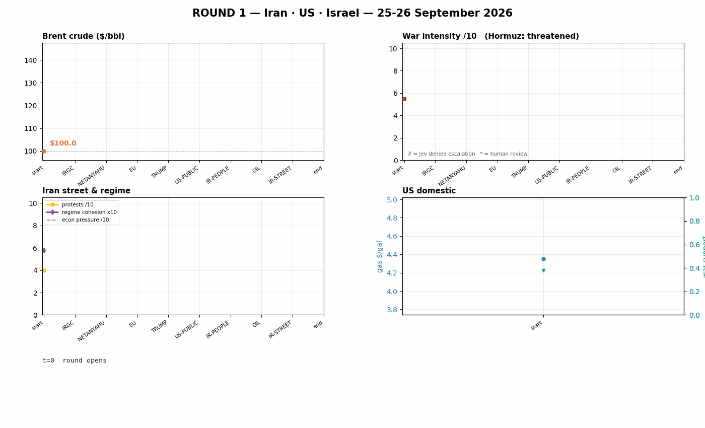
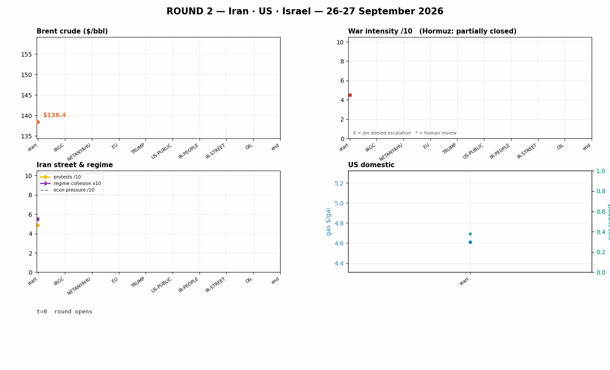
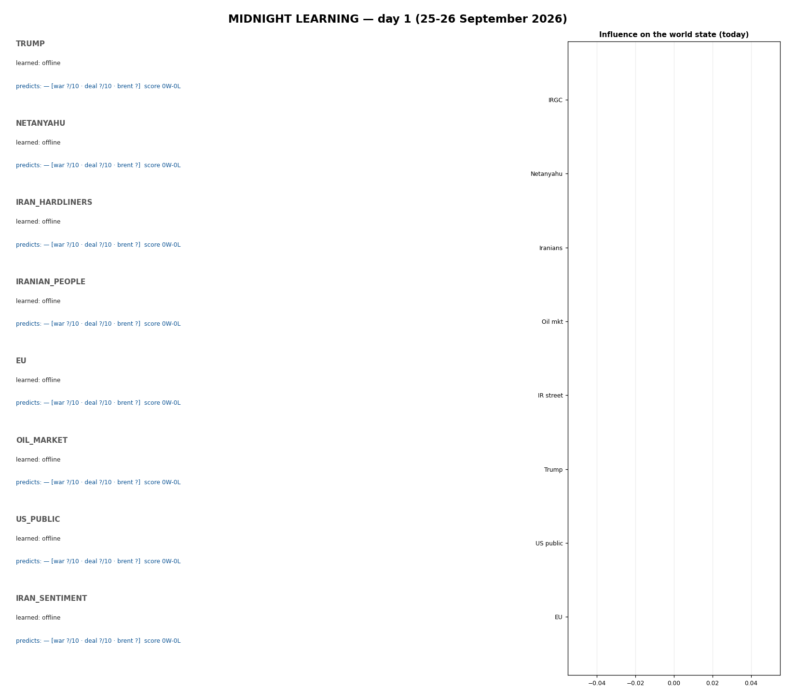
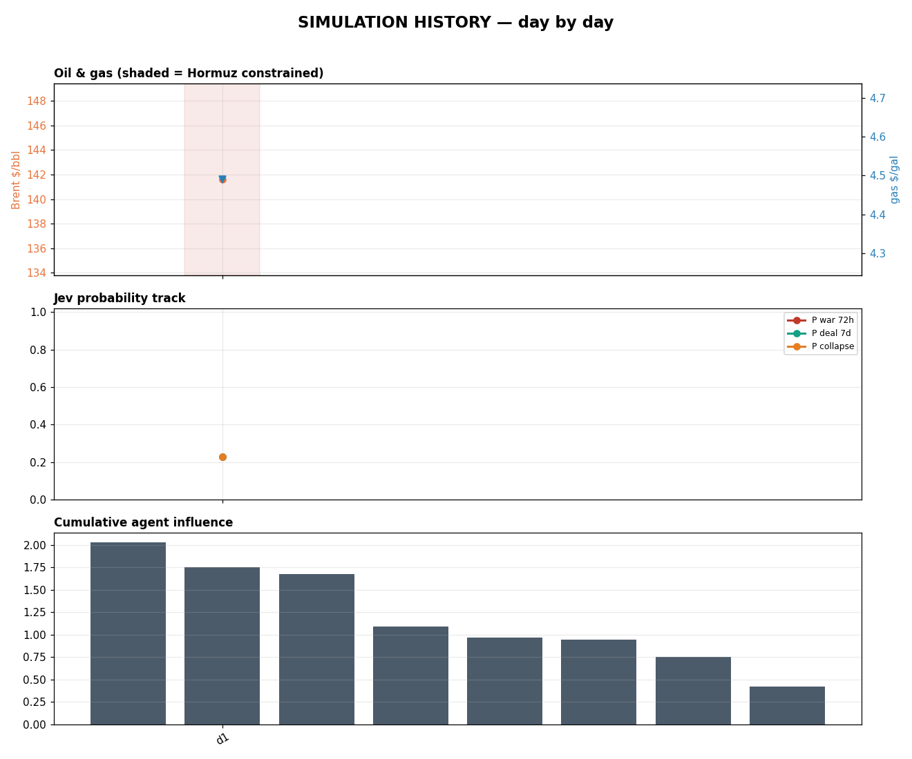

# Iran – US – Israel Conflict Simulation (Sept 2026)

Multi-agent geopolitical simulation: **LLM agents** stay in character and
generate statements/strategy; **Jev** — a fast "System 1" typed decision
layer — runs every round and never writes prose. Jev only returns typed
answers:

| Question                                   | Type   |
|--------------------------------------------|--------|
| Who acts next?                             | choice |
| May this agent escalate militarily?        | noul   |
| P(full-scale war, next 72h)                | score  |
| P(deal / ceasefire, next 7d)               | score  |
| P(Iranian economic collapse accelerates)   | score  |
| Is the oil price reaction realistic?       | noul   |
| Does this action need human review?        | noul   |

## Architecture

```
SituationState ──> Jev (typed gates + probabilities)
       │                    │ decides acting order + escalation gates
       ▼                    ▼
   8 LLM agents ──> AgentActions ──> world-update rules ──> new state
       ▲
   X/Twitter feed (seeded per round; agents must cite a post by @handle)
```

- `jev/` — decision layer. `JevClient` asks narrow questions over HTTP to a
  small local model (default `llama3.2:3b`), parses the JSON answer into a
  typed `JevAnswer`, and falls back to a deterministic heuristic if the model
  returns garbage (flagged `[fallback]` in the transcript).
- `agents/` — personas (Trump, Netanyahu, IRGC/Mojtaba, Iranian people, EU,
  oil market, US voters, Iran sentiment tracker) + the Ollama-backed agent
  wrapper.
- `simulation/` — `state.py` (SituationState), `xfeed.py` (posts),
  `world.py` (Brent fair-value model + state drift), `director.py` (round loop).
- `ollama_client.py` — stdlib-only Ollama chat client. No third-party deps.

## Requirements

- Python 3.10+
- Running Ollama with the configured models, e.g.:

```bash
ollama pull llama3.2:3b          # Jev
ollama pull qwen35-uncensored    # default agent model
```

Model assignments live in `config.py` (env overrides: `SIM_JEV_MODEL`,
`SIM_AGENT_MODEL`, `SIM_FAST_MODEL`, `OLLAMA_HOST`).

## Run

```bash
python3 main.py                     # Round 1: 25–26 Sept 2026
python3 main.py --rounds 5          # keep simulating; state carries forward
python3 main.py --resume out.json   # continue a saved world (--dump file)
python3 main.py --fast              # all agents on llama3.2:3b (quickest)
python3 main.py --offline           # no LLM calls — heuristic Jev + stub agents
python3 main.py --no-viz            # skip animation rendering
python3 main.py --dump out.json     # save verdicts + full state to JSON
```

## Daily learning cycle (midnight)

After each day/round closes, the Director runs a midnight cycle:

1. **Ground truth is assembled** — every state change the day produced,
   the settled Brent price, Jev's scores, and (optionally) real-world
   events injected from `real_events/dayN.txt` if that file exists.
2. **Every agent reflects** — each gets the day's outcomes plus its own
   prediction from the previous midnight, and returns:
   `LEARNED / BELIEF / STANCE / PREDICTION / P_WAR / P_DEAL / BRENT_DIR`.
3. **Memory feeds back** — the last lessons + current stance are injected
   into the agent's prompt next day, so behaviour genuinely shifts
   (e.g. an agent burned by a failed escalation request stops requesting).
4. **Predictions are scored** — yesterday's `BRENT_DIR` call is graded
   against the actual settle; each agent carries a win/loss scorecard.

A short "Learning Update" block is printed per agent, and memories are
saved into `--dump` files so `--resume` restores what agents learned.

## Generated artifacts (every day)

- `roundN_animation.gif` — animated 4-panel build: Brent, war intensity
  (X = Jev denied an escalation request, \* = human-review flag), Iran
  street/regime, US domestic — plus an event ticker and Jev's final scores.
- `roundN_summary.png` — the final frame as a static chart.
- `dayN_learning.png` — the midnight board: each agent's lesson,
  prediction, forecast numbers, scorecard, and today's influence ranking.
- `sim_history.png` — cumulative history across all days: Brent & gas
  (Hormuz-constrained days shaded), the Jev probability track
  (war / deal / collapse), and cumulative agent influence.

Snapshots are taken after every agent action (`world.apply_single_action`
+ `tick_brent`), so the animation shows the round unfolding act by act.

## Gallery

Round 1 — the day unfolds act by act; each frame is one agent's move:



Round 2 — Hormuz partially closed; watch Brent climb past $150 while Jev
keeps denying escalation (black X markers on the war panel):



Midnight learning board — per-agent lessons, predictions for tomorrow,
and who actually moved the world state:



Cumulative history across days — oil track, Jev probability track,
influence totals:



## Steer the simulation

- Seed new X posts in `simulation/xfeed.py` (`ROUND_POSTS[2]`, `[3]`, …) —
  agents cite them and the market reacts to them.
- Edit `simulation/world.py` to change how actions move oil, protests, and
  war intensity.
- Jev's question text lives in `jev/client.py`; tighten or add questions there.
