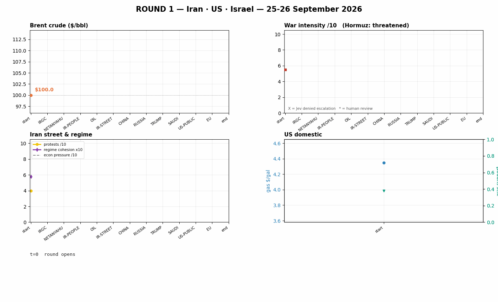
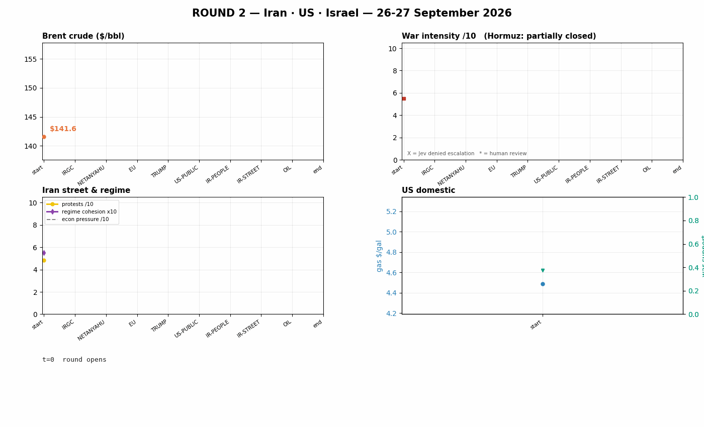
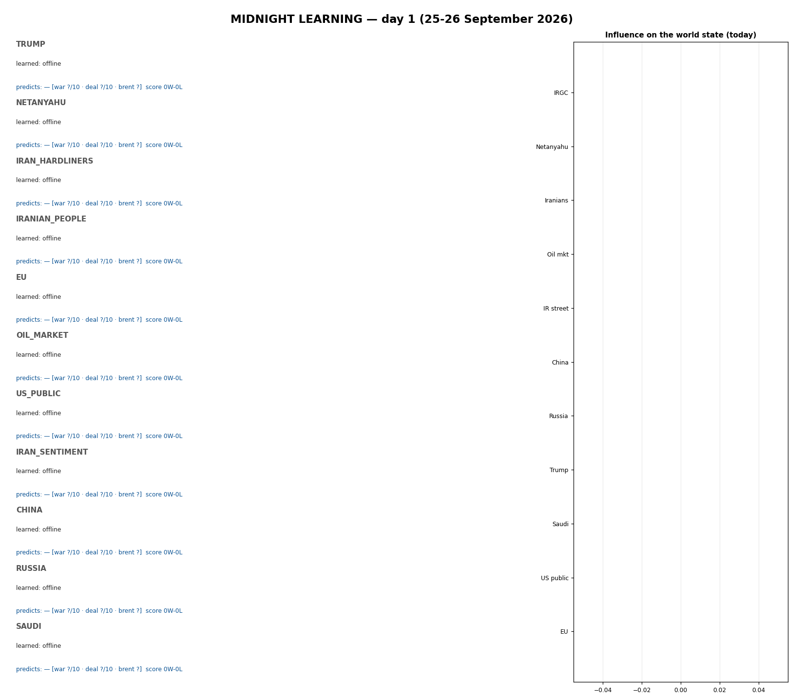
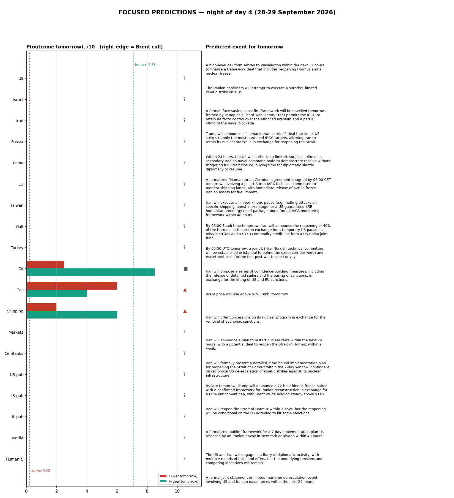
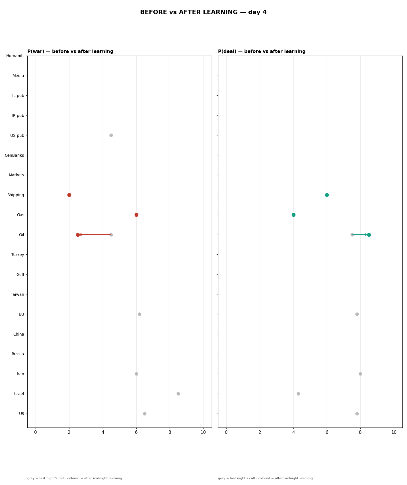
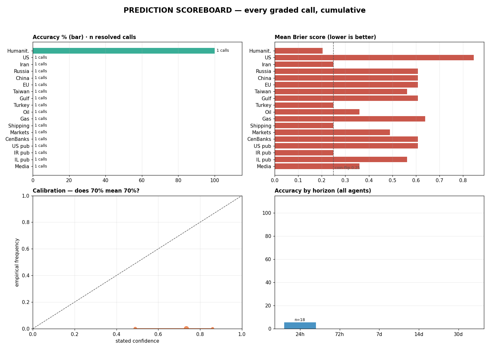
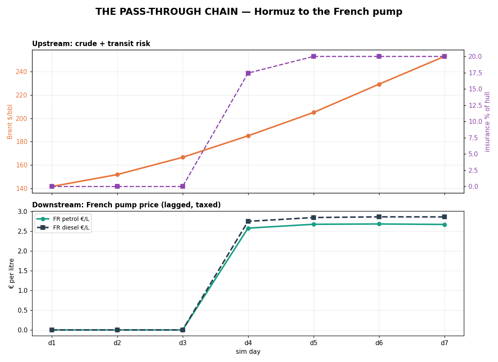
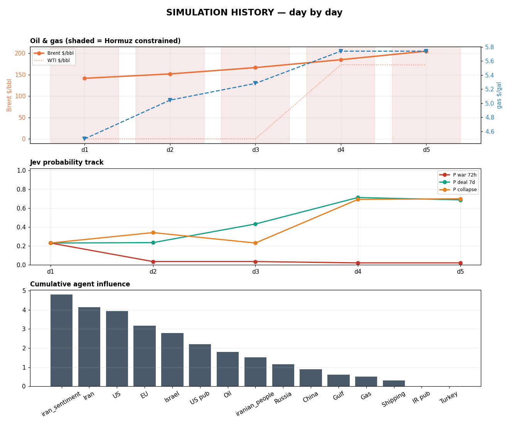

# Iran – US – Israel Conflict Simulation (Sept 2026)

[](https://www.python.org/)
[](https://ollama.com)
[](jev/)
[](https://ollama.com/library/llama3.2)
[](https://ollama.com)
[](https://matplotlib.org)
[](config.py)

A fully local multi-agent geopolitical simulation. Nineteen LLM agents
in three layers play
state and non-state actors in a fictionalized September-2026 Iran–US–Israel
war; a fast typed decision layer called **Jev** governs who may act, who may
escalate, and how probable war / deal / collapse are — every single day.

The split is deliberate:

- **Agents (System 2, big models)** — stay strictly in character, write
  statements, strategy, and private reasoning. They never decide game
  mechanics.
- **Jev (System 1, small fast model)** — never writes prose. It only
  returns typed answers: a `choice` (who acts next), a `noul` (yes/no
  gate), or a `score` (calibrated probability 0–1).

## In plain words

Think of it as a **fake world that plays itself twice a day**. Nineteen
characters — Trump, Netanyahu, Iran's generals, an oil trader, a panicked
French voter — are each played by an AI on your computer. Every 12 hours
(00:00 and 12:00)
the drama advances one day; then every character goes home, thinks about
what happened, and wakes up a little smarter.

**A day in three moves:**

1. **Jev decides what matters.** A small, fast model — the director. It
   picks who is urgent enough to act today (max ~13), asks whether an
   escalation should be permitted, and scores three headline
   probabilities: war in 72h, deal in 7d, Iranian collapse.
2. **Agents act in character.** Each agent reads its persona
   ("you want X, you fear Y"), its memory of past lessons, the current
   world state, fake X posts, and tonight's **real headlines** fetched
   from the web. It writes what it does — strike, sanction, negotiate,
   panic. `world.py` turns the wording into numbers: war intensity moves,
   Brent moves, the rial moves, French pump prices move.
3. **Midnight: everyone gets graded.** The sim compares today's reality
   (simulated world *plus* real Brent/gold prices and real news) against
   the bets each agent filed on previous nights. Each agent sees its own
   report card — "your 72h call resolved WRONG, you gave 85%" — writes a
   lesson, updates its stance, and files five new bets for the coming
   days. The lesson goes into memory and shows up in tomorrow's prompt.

So an agent that keeps crying wolf **literally becomes more cautious** —
its failed calls are put back in front of it every night. Agents that
forecast well accumulate better scorecards.

**Predictions are falsifiable bets, not vibes.** Every night each agent
files five dated claims — 24h / 72h / 7d / 14d / 30d — with a confidence
number and a declared source (X feed, real wire, markets, memory, or the
day's transcript). When a horizon matures, Jev judges the claim against
the day's ground truth. Accuracy, Brier score, calibration, false
positives/negatives, and performance by horizon and by source are all
tracked cumulatively and drawn in `media/prediction_scoreboard.png`.

**Three prediction layers, end to end:**

```
Geopolitical events ──> Economic effects ──> Real-world impact
(what happens next)   (oil, gas, shipping,   (French petrol and
                       markets, central      diesel in €/L,
                       banks)                minus any rebate)
```

Every image is **regenerated after each night's learning cycle**, and the
day's ready-to-paste post lands in `posts/dayN_tweet.txt` with the chart
attached. The daemon then sleeps until the next 12-hour mark and repeats —
fully hands-off.

## Scenario seed (25 September 2026)

- ~7 months into the war. Khamenei Sr. was killed early on; **Mojtaba
  Khamenei** is Supreme Leader, IRGC dominates the war cabinet.
- Trump at the UNGA framed a binary choice: a deal that lets Iran rebuild,
  or annihilation. Witkoff/Kushner met Iranian officials on the sidelines.
- Limited exchanges of fire continue. Brent ≈ $100. US midterms ~40 days
  out. Iran's economy is under blockade, ~60% inflation, rial ≈ 1.65M/USD.

## The stack — what runs what

| Component | Model (default) | Job |
|---|---|---|
| **Jev** decision layer | `llama3.2:3b` | typed gates + probabilities only; never prose |
| **Character agents** | `qwen35-uncensored` | in-character statements, strategy, midnight learning |
| **Oil market / IR street tracker** | `llama3.2:3b` | structured metric output |
| **Charts** | matplotlib + pillow | GIF animation + PNG boards |
| **Runtime** | stdlib HTTP → Ollama | zero third-party deps for the sim core |

Swap any model via env: `SIM_JEV_MODEL`, `SIM_AGENT_MODEL`,
`SIM_FAST_MODEL` (see `config.py`).

## The agents — three layers

**GEOPOLITICAL** — states that move armies and sign deals:

| Agent | What drives it |
|---|---|
| **US** (Trump White House) | Look strong; midterms in ~40 days; gas prices down; a deal sold as total victory is ideal, but he will escalate if humiliated. |
| **Israel** (Netanyahu govt) | Permanent elimination of Iran's nuclear capacity; maximum freedom of military action; will act alone to kill a bad deal. |
| **Iran** (IRGC + Mojtaba) | Regime survival; keep the 60% stockpile as insurance; weaponize oil/Hormuz leverage; outwait US domestic pain. |
| **Russia** | High oil prices fund its war economy; US bandwidth diverted from Ukraine; arms/air-defence sales to Tehran; keep Iran alive but dependent; veto cover at the UNSC. Wants the war long and expensive — for America. |
| **China** | Keep Hormuz open (most of its Gulf crude transits it); buy discounted Iranian barrels via yuan channels; pose as THE mediator while America burns credibility; study US war-prosecution for the Taiwan file. |
| **EU** | De-escalation above all; can't absorb another energy shock; offers escrow mechanisms, sanctions-relief architecture, venues. |
| **Taiwan** | US munitions and carriers diverted to the Gulf thin its deterrence; watches PLA tempo for opportunism; quietly trades semiconductor/intel cooperation for reassurance. |
| **Gulf** (Saudi-led GCC) | No Iranian bomb, but no war on Gulf soil; high oil revenue funds Vision 2030 yet Hormuz closure strangles exports too; spare capacity is leverage — released only for hard US security guarantees. |
| **Turkey** | NATO's southern flank hosting Incirlik while selling drones and brokering corridors; weakened Iran = Kurdish risk and Caucasus/Iraq opportunity; Istanbul as the neutral venue; de-escalate loudly, profit quietly. |

**ECONOMIC** — markets that price the war in real time (structured
output; their calls blend 50/50 into the world state at settle):

| Agent | Output |
|---|---|
| **Oil market** | `BRENT:` + `FORECAST:` — Hormuz premium, incidents, intensity, SPR. |
| **Gas / LNG** | `TTF:` + `FORECAST:` — Qatari LNG transits Hormuz; no SPR exists for gas. |
| **Shipping & insurance** | `INSURANCE:` + `FREIGHT:` — war-risk % of hull, VLCC rerouting, crew refusals. |
| **Financial markets** | `GOLD:` + `SPX_DIR:` — safe-haven flows, rate-path repricing, vol. |
| **Central banks** | Fed/ECB composite — trapped between energy inflation and recession; jawbones, never panics. |

**SOCIETY / INFORMATION** — the constraint surface the other layers read:

| Agent | What it is |
|---|---|
| **US public** | Midterm voters: cheap gas, no endless wars, no body bags — with a loud "finish the job" minority. |
| **Iranian public** | Street + sentiment tracker: protest level, war fatigue, nationalism rally, black market. |
| **Israeli public** | Reservist fatigue, displaced north, hostage families, brain drain — proud, frightened, furious. |
| **Media** | The information environment: dominant frames, viral clips, fog. Doesn't choose sides — chooses frames. |
| **Humanitarian** | UN OCHA/ICRC composite: casualties, displacement, access corridors — neutral because access dies otherwise. |

## How one day runs

```
SituationState ──> Jev: who acts next?  ──loop──>  for each chosen agent:
   ▲                 │                            Jev: escalation permitted?  (noul)
   └─ live wire      │                            Jev: needs human review?    (noul)
     (real headlines │                            agent speaks (cites X posts
      each morning)  │                             + sees live wire)
                     │                            world nudges -> snapshot
                     ▼
              Jev scores: P(war 72h) · P(deal 7d) · P(collapse)
                          -> calibrated against Jev's own track record
              oil settle: market call vs Jev realism check (fair-value override)
              MIDNIGHT LEARNING: ground truth -> agents reflect -> predictions
              render all charts -> posts/dayN_tweet.txt -> checkpoint dump
```

Jev's seven questions per round:

| Question | Type | Used for |
|---|---|---|
| Who acts next? | `choice` | the acting order (or `end_round`) |
| Escalation permitted? | `noul` | per-agent military gate |
| P(full-scale war, 72h) | `score` | round verdict + history track |
| P(deal / ceasefire, 7d) | `score` | round verdict + history track |
| P(Iranian econ collapse) | `score` | round verdict + history track |
| Oil reaction realistic? | `noul` | if NO → fair-value model overrides the market call |
| Needs human review? | `noul` | flagged actions run under a "review hold" |

**Score calibration** (`jev/calibrate.py`) — small System-1 models anchor
on a prior (everything drifts toward ~0.23). After each day, the three
headline scores are re-issued through a calibrator that knows Jev's own
track record: `calibrated = 0.75·(raw − 0.5·bias) + 0.25·base_rate`,
where *bias* is mean(raw − realized) over past days and *base_rate* the
empirical event frequency. Realized events are judged from the sim's own
day-over-day deltas (war = intensity jump or Hormuz degradation; deal =
intensity drop or Brent −$8; collapse = econ-pressure/protest spike).
With under two scored days the raw value passes through untouched;
calibrated answers are marked `source: jev-calibrated` in the log.

## The world model

`simulation/world.py` maps what agents *say and do* onto state variables:

- **Keyword-driven effects** — "strike/bomb/missile" raises war intensity;
  "hormuz/strait/tanker" raises incidents (and "close/shut/mine" flips
  Hormuz to `partially_closed`); "ceasefire/deal/framework/corridor"
  strengthens the diplomatic track and cools intensity; "sanction" raises
  economic pressure; "protest/bazaar shut" raises street pressure.
  Great-power levers have their own keywords: "s-400/arms sale/military
  aid" lifts intensity but shores up Tehran; "yuan/barter/discounted
  crude" eases Iran's economic pressure and adds supply; "spare capacity/
  raise output/east-west pipeline" cuts Brent and insurance; "mediate/
  broker/muscat/beijing" opens a diplomatic track.
- **Markets beyond Brent** — WTI tracks Brent minus a crisis-widened
  spread; gold drifts toward `1900 + 110·intensity + 200·(Hormuz≠open)`;
  war-risk insurance is `base(Hormuz) + 0.35·incidents` (open 0.6% →
  closed 12% of hull). All three tick toward fair value alongside Brent.
- **The French pump (impact layer)** — `petrol = 1.62 + 0.006·Brent`,
  `diesel = 1.79 + 0.006·Brent`, minus any active `fr_fuel_rebate`
  (€/L). Calibrated to reality: Brent ~$100 → €2.22/€2.38 per liter
  (actual fuel-prices.eu values, Sep 2026). ~60% of the pump price is
  fixed French tax, so crude arrives damped and ~1–2 weeks late
  (12% drift/day). When the EU or any actor says "rebate / tax cut /
  bouclier / price cap", the rebate activates (~−€0.15/L per mention)
  and sunsets ~12%/day — intervention is real, temporary, and visible
  on `media/fuel_track.png`. The midnight wire also fetches the **real**
  French petrol/diesel price so agents grade pump forecasts against
  actual data.
- **Oil** — `fair_brent = 82 + Hormuz_premium + 1.2·intensity + 2·incidents`.
  Premium: open $0, threatened $18, partially closed $35, closed $60.
  Intra-day, Brent drifts 30% toward fair value after every act; at settle,
  the market agent's call is blended 50/50 with fair value — unless Jev
  rules it unrealistic, in which case fair value wins outright.
  US gas ≈ `$3.10 + 0.024·(Brent − 70)`.
- **End-of-day drift** — economic pressure ratchets up, protests scale with
  it, regime cohesion decays, war support slides with pump prices.
- **Influence** — each act's own deltas on tracked metrics (war, protests,
  pressure, cohesion, gas, Brent) are summed into a per-agent influence
  score. Ambient market drift is deliberately *not* attributed, so the
  metric measures agency, not luck.

## Where the information comes from (live sources)

Nothing is scraped behind a paywall and **no API keys are required** —
every fetch is a plain unauthenticated HTTP GET from
`simulation/realworld.py`, with a 12 s timeout, and every one of them
**fails soft**: if a source is down the day still runs, just on simulated
ground truth.

| What | Source | Exact endpoint | Refreshed |
|---|---|---|---|
| Brent crude (`BZ=F`) | [Yahoo Finance](https://finance.yahoo.com/quote/BZ%3DF/) | [`query1.finance.yahoo.com/v8/finance/chart/BZ=F`](https://query1.finance.yahoo.com/v8/finance/chart/BZ=F?interval=1d&range=5d) | at midnight, per day |
| WTI crude (`CL=F`) | [Yahoo Finance](https://finance.yahoo.com/quote/CL%3DF/) | [`.../chart/CL=F`](https://query1.finance.yahoo.com/v8/finance/chart/CL=F?interval=1d&range=5d) | at midnight, per day |
| Gold (`GC=F`) | [Yahoo Finance](https://finance.yahoo.com/quote/GC%3DF/) | [`.../chart/GC=F`](https://query1.finance.yahoo.com/v8/finance/chart/GC=F?interval=1d&range=5d) | at midnight, per day |
| French pump prices (petrol 95 / diesel) | [fuel-prices.eu](https://www.fuel-prices.eu/France/) | [`fuel-prices.eu/France/`](https://www.fuel-prices.eu/France/) (two `<meta content>` regexes) | at midnight, per day |
| Conflict headlines | [Google News RSS](https://news.google.com/rss/search?q=Iran%20Israel%20war%20OR%20Strait%20of%20Hormuz%20OR%20Brent%20crude%20when:1d&hl=en-US&gl=US&ceid=US:en) | `news.google.com/rss/search?q=Iran Israel war OR Strait of Hormuz OR Brent crude when:1d` | **twice**: 5 headlines when the day opens, 8 at midnight |
| Model inference | [Ollama](https://ollama.com), local only | `http://localhost:11434` (`OLLAMA_HOST`) | every call |

Two things are **not** live, by design:

- **The default X/Twitter feed is synthetic.** `simulation/xfeed.py` holds
  hand-written posts with plausible handles per round — but see
  [The social feed](#the-social-feed--real-posts-no-paid-api) below: it can
  now collect real public posts instead.
- **The scenario itself is fictional** (September 2026). Real data is used
  only as a yardstick to grade forecasts, never as the plot.

How a day's information flow works:

1. **Day opens** — `realworld.fetch_headlines(5)` pulls the last 24 h of
   real headlines and injects them into *every* agent prompt as a
   `LIVE WIRE` block, labelled "treat as actual events unfolding in
   parallel" (`agents/base.py:act`). They are also stored in the dump
   under `live_wire`.
2. **Midnight** — `realworld.fetch_day(N)` pulls the three futures
   quotes, the French pump prices and 8 headlines, and writes them to
   **`real_events/dayN.txt`**, which is then appended to the day's ground
   truth as the `REAL-WORLD WIRE` block.
3. **Manual override** — if `real_events/dayN.txt` already exists, it is
   used verbatim and **no fetch happens**. Drop your own file there to
   feed the sim whatever wire you want (real, hypothetical, or a stress
   test).
4. **`--offline`** skips all of it: no HTTP, no Ollama, heuristic Jev.

Check what a given day actually saw:

```bash
cat real_events/day4.txt        # the midnight wire, verbatim
rg '"live_wire"' -A6 sim_log.json | head -20   # the morning headlines
```

Each prediction an agent files also **declares which of these inputs drove
it** (`SOURCE: xfeed | wire | markets | memory | transcript`), so the
scoreboard can show accuracy *by source* — i.e. whether the real wire
beats the synthetic feed as a signal.

## The social feed — real posts, no paid API

`simulation/xfeed.py` is a pluggable provider layer:

```
XFeed
├── SyntheticXFeed     hand-written posts — deterministic; tests + offline
├── RealPublicXFeed    real X posts from free public endpoints (below)
└── BlueskyPublicFeed  real posts via Bluesky's public unauthenticated API
```

**How the free X path works.** There is no free public X *search* API —
anyone claiming otherwise sells a paid proxy. What exists unauthenticated:

- **`syndication.twitter.com`** — the same backend X's own embed.js
  widgets call to render timeline embeds. `RealPublicXFeed` requests each
  watched account's public timeline once, extracts the embedded
  `__NEXT_DATA__` JSON, and pulls out real tweets. No login, no key, no
  credential borrowing — and **no retry around a 429**: a rate limit is a
  rate limit. In practice this endpoint is heavily throttled (often
  unusable from datacenter IPs), so treat it as best-effort.
- **Nitter RSS mirrors** — optional, configured per-instance; every public
  instance is currently dead, which is itself part of the answer: *as of
  today there is no reliable free path to arbitrary X content.*

Both are honest about it: if zero posts come back, the feed raises

```
Real X feed unavailable.
No real posts were supplied to the simulation.
Use SyntheticXFeed explicitly for testing.
```

and the agents that day are explicitly told there are **no posts** — the
sim never swaps in fabricated content silently.

**The honest alternative — Bluesky.** `provider: bluesky` uses
`api.bsky.app/xrpc/app.bsky.feed.searchPosts` — real public search, no
auth required. Posts arrive labelled `source: bluesky` and the agent
prompt says so explicitly (*"real posts, NOT X/Twitter"*) — they are never
represented as X content anywhere. `provider: auto` tries real X first,
then Bluesky; when it falls through, the status records
`fallback_from: real-x` with the failure reason, so the substitution is
always visible in the log.

**Enabling it** — config block in `config.py` (all env-overridable):

```python
X_FEED = {
    "provider": "synthetic",   # SIM_FEED_PROVIDER: real|bluesky|auto
    "query": "Iran OR Israel OR US OR Trump OR Hormuz OR Brent",
    "max_posts": 50,
    "cache": True,             # SIM_FEED_CACHE=0 disables
    "cache_ttl_hours": 12,     # SIM_FEED_TTL_H
    "accounts": [...],         # watched handles for the X embed path
    "nitter_instances": [...], # optional Nitter mirrors
    "timeout": 10,
}
```

```bash
SIM_FEED_PROVIDER=auto python3 main.py --daemon --dump sim_log.json
# or per-run:
python3 main.py --feed bluesky
```

**Caching.** Every successful collection is written to
`cache/xfeed/<provider>_<queryhash>.json` (query + account list keyed;
gitignored). A cache younger than `cache_ttl_hours` is served without any
network access — a simulation can be re-run entirely offline from cache.
If a live fetch fails but an *expired* cache exists, it is served as
`stale-cache` and flagged as such in the status — stale real data, clearly
marked, never fresh-looking.

**Provenance — how to tell real from synthetic.** Every post normalizes to
`{post_id, author, text, created_at, url, retrieved_at, source}` where
`source` ∈ `synthetic | x:syndication | x:nitter@<host> | bluesky`.
Provenance shows up in three places: the `[FEED] provider=… state=…` line
in the console log, the `xfeed` block in the dump file (every post stored
with its full record), and the header of the feed section in each agent
prompt, which states plainly whether posts are real X, real Bluesky, or
fictional. Relevance tags (which agents see which post) are inferred from
keywords for real posts and curated for synthetic ones; every post is also
deduplicated by `post_id` (text-hash fallback) and query-filtered before
it reaches an agent.

**Tests** — `tests/test_xfeed.py` covers parsing, normalization, dedup,
caching, provenance, filtering and the unavailable-source error with fully
mocked HTTP: `python3 -m unittest discover -s tests`.

## The midnight learning cycle

After each day closes:

1. **Ground truth** — the day's actual state changes, the settled Brent,
   Jev's scores, plus the **real-world wire**: at midnight the sim fetches
   the actual Brent/WTI/Gold close (Yahoo Finance) and the day's top
   conflict headlines (Google News RSS) into `real_events/dayN.txt`, so
   agents grade
   their predictions against reality, not just the simulation. A
   hand-written `real_events/dayN.txt` always takes precedence if it
   already exists; if the fetch fails the day simply runs on simulated
   ground truth.
2. **Every agent reflects** (`Agent.learn`): gets the day's outcomes + its
   own prediction from last midnight, returns
   `LEARNED / BELIEF / STANCE / PREDICTION / P_WAR / P_DEAL / BRENT_DIR`.
3. **Memory persists** — last lessons + current stance are injected into
   the next day's prompt (`_memory_block`), so predictions made at night
   measurably change daytime behavior.
4. **Scorecard** — yesterday's `BRENT_DIR` call is graded against the real
   settle; each agent accumulates a W–L record.
5. Memories are written into `--dump` files; `--resume` (or a daemon
   restart) restores them, so agents keep what they learned.

## The prediction engine

The loop is `prediction -> outcome -> evaluation -> memory update`. At
midnight each agent files **five dated, falsifiable claims** with real
confidence numbers (`simulation/predictions.py`):

| Horizon | What agents predict |
|---|---|
| 24h | major military escalation / de-escalation |
| 72h | new attacks, ceasefire, retaliation, diplomatic moves |
| 7d | conflict intensity, Hormuz/shipping disruption |
| 14d | oil direction + volatility, US/EU/Russia/China policy responses |
| 30d | sanctions, negotiations, deployments, expansion to another country |

Jev also scores two real-world-impact questions every night (calibrated
like the headline scores): `P(French petrol +5% within 30d)` and
`P(major supply disruption within 14d)`. The gas/LNG agent calls French
pump prices directly (`FR_PETROL:`/`FR_DIESEL:`), and those calls nudge
the simulated pump.

Each night the ledger matures: predictions whose horizon elapsed are
judged against the day's ground truth — **Jev acts as the judge** online
(a typed noul verdict on substance), a keyword-overlap heuristic offline.
Resolved calls feed back into the agent's next reflection prompt
("your 72h call 'X' resolved WRONG — you gave 85%"), so forecast skill
actually shapes tomorrow's reasoning. Pending predictions and stats
persist in the dump file across restarts.

**Metrics tracked** (per agent, cumulative, rendered to
`media/prediction_scoreboard.png` nightly):

- **Accuracy** and **mean Brier score** `(conf − outcome)²`
- **Calibration curve** — confidence bins vs empirical frequency
- **False positives / false negatives** (conf ≥50% that missed, or
  events missed under 50%)
- **Accuracy by horizon** (24h → 30d) and **by info source** — each
  prediction declares whether `xfeed | wire | markets | memory |
  transcript` drove it, so you can see which signals actually pay off.

## How "training" happens for the next prediction

**No weights are ever updated.** There is no fine-tuning, no gradients, no
LoRA — the Ollama models are frozen. All learning is **in-context**: what
changes between days is the *text* each agent is fed. That is the whole
mechanism, and it is deliberately auditable — you can read every byte of
what an agent "learned" in `sim_log.json`.

The loop, in the order it executes each midnight
(`simulation/director.py` → `predictions.evaluate_due` →
`agents/base.py:learn`):

1. **Ground truth is assembled** — the day's state deltas (Brent, war
   intensity, Hormuz status, protests, regime cohesion, US gas), Jev's
   three scores, and the real-world wire from `real_events/dayN.txt`.
   This single text blob is the *only* arbiter.
2. **Matured claims are graded first, before the agent reflects.** Every
   pending prediction whose `due` day has arrived is judged against that
   blob: **Jev returns a typed yes/no verdict** on whether the event
   substantively occurred (online), or a keyword-overlap heuristic decides
   (offline: ≥50% of content words present → hit, 0 → miss, in-between →
   undetermined). Undetermined claims linger one day, then **expire**
   rather than being scored as wrong — the ledger refuses to guess.
3. **Each graded claim produces numbers**: `brier = (conf − outcome)²` and
   `hit = (conf ≥ 0.5) == outcome`, accumulated per agent into `n`,
   accuracy, mean Brier, false positives/negatives, and splits **by
   horizon** and **by declared source**.
4. **The results are handed back to the agent as prompt text** — this is
   the actual "training signal":

   ```
   YOUR PREDICTIONS THAT JUST RESOLVED:
     - [72h] 'Iran closes Hormuz to all tanker traffic' -> WRONG
       (you gave 85%, it did not happen)
   ```

   Immediately followed by "Reflect coldly… you will be graded." An agent
   that keeps crying wolf therefore reads its own failed 85% calls every
   single night, which is why over-confident personas measurably cool off.
5. **The agent returns a typed update**, not prose:
   `LEARNED / BELIEF / STANCE / PREDICTION / PRED_24H…PRED_30D (each with
   a 0–100 confidence) / SOURCE / P_WAR / P_DEAL / BRENT_DIR`.
6. **What carries into tomorrow** — the `LEARNED` line is pushed onto the
   agent's memory (**last 8 lessons only**, a deliberate rolling window)
   and `STANCE` replaces the old one. Both are rendered into the *daytime*
   prompt by `_memory_block`, so tonight's lesson changes tomorrow's
   actions, not just tomorrow's forecast.
7. **The five new claims are filed** into the ledger with
   `made = today`, `due = today + {1,3,7,14,30}`, their confidence, and
   their declared `SOURCE` — and the cycle repeats. Pending lists are
   capped at the most recent 40 claims per agent.
8. **Persistence** — memory, stance, pending claims and `pred_stats` are
   written into the `--dump` file every day. `--resume` (and a daemon
   restart) reloads them, so learning survives restarts and the ledger is
   continuous across runs. Delete the dump and every agent is amnesiac
   again.

So "smarter tomorrow" means precisely: *worse Brier → harsher feedback text
in the prompt → a different stance and lower confidences filed.* It is
a closed evaluation loop over a frozen model, and its effect is visible in
`media/dayN_before_after.png` (last night's call vs tonight's revision) and
in the calibration curve on `media/prediction_scoreboard.png`.

## The swarm — a second forecasting voice

Jev is one small model scoring alone. `simulation/swarm.py` is the swarm
answer: after the midnight learning cycle every agent has already filed
`P_WAR` / `P_DEAL` / `BRENT_DIR`, so the swarm **costs no extra LLM
calls**. It runs a UNU-style iterated convergence on those votes:

- each vote is weighted by the voter's **track record** (prediction
  accuracy in the ledger so far; unproven agents start neutral at 0.5);
- each iteration pulls every position toward the **skill-weighted** mean,
  with a twist — the pull is `pull · (1 − skill)`, so proven forecasters
  are *sticky* and unproven ones get dragged toward the consensus;
- the swarm settles when the largest movement drops below epsilon or the
  iteration cap hits; the **residual dispersion is kept on purpose** — it
  is the honest measure of how much the group still disagrees, and feeds
  the `conviction` score (`1 − 2·mean_dispersion`).

Brent direction resolves by skill-weighted plurality. The output lands in
the dump as `swarm` (consensus values, per-agent final positions,
conviction, `jev_gap` — the absolute distance between the swarm and Jev's
calibrated scores, itself a signal worth watching), prints a
`SWARM CONSENSUS` block each night, and adds a line to
`posts/dayN_tweet.txt`. Deterministic, stdlib-only, microseconds.

```
SWARM CONSENSUS — 5 voters, skill-weighted
  swarm P(war 72h)  0.60 (dispersion 0.037, 12 iters)
  swarm P(deal 7d)  0.48 (dispersion 0.039, 12 iters)
  swarm brent dir   up (57% of weighted votes)
  swarm-vs-Jev gap: p_war_72h Δ0.38 | p_deal_7d Δ0.23
```

Config in `config.py` (`SWARM`): `SIM_SWARM=0` disables; `SIM_SWARM_PULL`,
`SIM_SWARM_ITERS`, `SIM_SWARM_EPS` tune the convergence.

## Generated artifacts (every day)

| File | Contents |
|---|---|
| `media/roundN_animation.gif` | Animated 4-panel build, one frame per agent act: Brent path, war intensity (✕ = Jev denied an escalation request, ★ = human-review flag), Iran street/regime, US domestic — plus an event ticker and Jev's closing scores. |
| `media/roundN_summary.png` | The final animation frame as a static chart. |
| `media/dayN_learning.png` | Midnight board: each agent's lesson, prediction, P_war/P_deal, Brent call, W–L scorecard — and today's influence ranking. |
| `media/dayN_predictions.png` | Focused predictions: per-agent P(war)/P(deal) bars, Brent direction glyph, predicted event text, Jev's scores as reference lines. |
| `media/dayN_before_after.png` | Dumbbell chart: last night's call (grey) vs. tonight's post-learning update (colored arrow) for P(war) and P(deal). |
| `media/sim_history.png` | Cumulative: Brent & gas across days (Hormuz-constrained days shaded red), the Jev war/deal/collapse probability track, cumulative agent influence. |
| `media/prediction_scoreboard.png` | Prediction quality: per-agent accuracy + Brier, the calibration curve, accuracy by horizon — cumulative across all resolved calls. |
| `media/fuel_track.png` | The pass-through chain: Brent + Hormuz insurance upstream, French petrol/diesel at the pump downstream, rebate windows shaded. |
| `posts/dayN_tweet.txt` | Ready-to-paste daily post: day/date, Jev scores, Brent, key call, forecaster ledger line, disclaimer + attach-image reminder. |

## CLI

```
python3 main.py [options]

--rounds N      simulate N days in one process (state carries forward)
--resume FILE   continue from a --dump file (world + memories + history)
--daemon        stay resident; run one day every 12h (00:00 / 12:00), forever
--run-now       with --daemon: run one day immediately, then the schedule
--fast          every agent on the small model (llama3.2:3b)
--offline       zero LLM calls — heuristic Jev + stub agents (CI/debug)
--no-viz        skip all chart rendering
--no-learn      skip the midnight learning cycle
--dump FILE     append each day's verdict/state/learning to JSON
--no-push       with --daemon: don't commit/push the day's artifacts
--push          also publish after a one-off (non-daemon) run
--feed PROVIDER social-feed provider: synthetic | real | bluesky | auto
```

## Daemon mode (automatic 12-hourly runs)

```bash
nohup python3 main.py --daemon --dump sim_log.json > daemon.out 2>&1 &
```

Behavior:

- Runs one simulated day at every **12-hour mark of the local clock —
  00:00 and 12:00**. Marks are absolute, so a restart never drifts the
  schedule. Set `SIM_CYCLE_HOURS=6` (etc.) to change the cadence.
- Prints a timestamped banner when a new day starts and when each image is
  saved; between runs it prints
  `waiting for the next 12h mark (Xh until next cycle)`.
- Sleeps in 30 s slices — SIGTERM/SIGINT shut it down promptly and the
  checkpoint is always current.
- The `--dump` file doubles as the checkpoint: point the daemon at the same
  file on restart and it resumes the same world, agent memory included.
- If a day crashes, the error is logged and it retries on the next cycle —
  the checkpoint is never left half-written.
- After checkpointing it writes the day's ready-to-post summary file
  (see below).

## Auto-publishing to GitHub

In daemon mode, every completed day is **committed and pushed
automatically** once the charts, the post and the checkpoint are on disk
(`simulation/autopush.py`, called after `append_dump`). The log shows it:

```
[2026-09-29 00:11:04] DAY 5 COMPLETE — graphs + checkpoint saved
  [PUSH] committed day 5 artifacts
  [PUSH] pushed day 5 to origin/main
```

Rules it follows:

- **Only artifacts are staged** — `media/`, `posts/`, `real_events/` and the
  `--dump` file, by explicit path. Source edits you make while the daemon
  is resident are *never* swept into an automated commit.
- **Never forces, never rewrites history.** If the remote has diverged the
  push is rejected, the commit stays local, and the reason is logged
  (`! [rejected] … (fetch first)`). Resolve it with a normal
  `git pull --rebase`; the backlog goes out with the next run.
- **Nothing to commit → no empty commit** (identical charts on a rerun are
  detected and skipped).
- **Fails soft and time-boxed** (120 s): no remote, no network, or an
  SSH key that needs a passphrase logs one line and the daemon carries on.
  Git runs with `BatchMode=yes` / `GIT_TERMINAL_PROMPT=0`, so an
  unattended run can never hang on a credential prompt.

Turn it off with `--no-push`, or `SIM_AUTOPUSH=0`. For a one-off
(non-daemon) run, publishing is **opt-in** with `--push`:

```bash
python3 main.py --resume sim_log.json --dump sim_log.json --push
```

Note that `media/` is committed as ordinary git blobs, so history grows by
roughly 2.5 MB per run (the animation is the bulk of it). If that becomes
a problem, route `media/*.gif` and `media/*.png` through `git lfs track`.

## Configuration

Everything model-related lives in `config.py`, overridable by env:

| Env var | Default | Role |
|---|---|---|
| `SIM_JEV_MODEL` | `llama3.2:3b` | decision layer (should stay small/fast) |
| `SIM_AGENT_MODEL` | `qwen35-uncensored` | default character model |
| `SIM_FAST_MODEL` | `llama3.2:3b` | oil market, sentiment tracker, `--fast` |
| `OLLAMA_HOST` | `http://localhost:11434` | local Ollama endpoint |
| `SIM_CYCLE_HOURS` | `12` | daemon cadence, in hours of the local clock |
| `SIM_AUTOPUSH` | `1` | set `0` to disable the automatic git commit + push |
| `SIM_FEED_PROVIDER` | `synthetic` | `real` (public X) · `bluesky` · `auto` |
| `SIM_FEED_QUERY` | `Iran OR Israel OR US OR Trump OR Hormuz OR Brent` | feed search terms |
| `SIM_FEED_CACHE` | `1` | set `0` to always refetch the feed |
| `SIM_SWARM` | `1` | set `0` to disable the swarm consensus layer |

Notes: thinking-style models (qwen3.5, deepseek-r1, gemma4) are called with
`think=false` — otherwise they can exhaust `num_predict` on reasoning and
return empty statements. A bigger `SIM_JEV_MODEL` gives more differentiated
probabilities at the cost of speed.

## Requirements

- Python 3.10+, a running local Ollama — that's it for the sim core
  (stdlib-only HTTP client).
- `matplotlib` + `pillow` for charts/GIFs (`requirements.txt`).

```bash
ollama pull llama3.2:3b
ollama pull qwen35-uncensored
```

## File map

```
main.py                  CLI entry (+ daemon mode)
config.py                models, temperatures, endpoints
ollama_client.py         stdlib-only /api/chat client (think=false handled)
jev/                     decision layer
  types.py               JevAnswer (choice|noul|score), TurnGate, RoundVerdict
  client.py              typed questions -> JSON -> validation -> heuristic fallback
  calibrate.py           de-anchors scores using Jev's own realized track record
agents/
  personas.py            the 19 in-character system prompts
  base.py                generation, output parsing, memory + learn()
simulation/
  state.py               SituationState, Sept-2026 seed, date advance, resume
  xfeed.py               feed providers: synthetic script / real public X /
                         Bluesky; normalization, dedup, cache, provenance
  world.py               action->state rules, fair-Brent model, drift
  director.py            the day loop, Jev gates, midnight learning, artifacts
  viz.py                 GIF animation + learning/prediction/history PNGs -> media/
  daemon.py              resident 12-hourly scheduler with checkpointing
  realworld.py           Brent/WTI/Gold + FR pump + headlines fetch (no keys)
  predictions.py         prediction ledger: horizons, judging, Brier, calibration
  swarm.py               skill-weighted swarm consensus over nightly votes
  dailypost.py           writes posts/dayN_tweet.txt for manual posting
  autopush.py            commits + pushes the day's artifacts to the remote
real_events/dayN.txt     optional real-world injection for the learning cycle
posts/dayN_tweet.txt     ready-to-paste daily post (manual X/Twitter)
media/                   all generated PNG/GIF artifacts
```

## Gallery

Round 1 — the day unfolds act by act; each frame is one agent's move:



Round 2 — Hormuz partially closed; watch Brent climb past $150 while Jev
keeps denying escalation (black ✕ markers on the war panel):



Midnight learning board — per-agent lessons, predictions for tomorrow,
and who actually moved the world state:



Focused predictions — tonight's calls vs Jev's reference lines:



Before vs after learning — how beliefs moved overnight:



Prediction quality — per-agent accuracy + Brier, the calibration curve,
and accuracy by horizon:



The pass-through chain — Hormuz insurance + Brent upstream, French pump
prices downstream:



Cumulative history — oil track, Jev probability track, influence totals:



## Steer the simulation

- **Inject reality**: write `real_events/dayN.txt` before a midnight run —
  it's added to the ground truth every agent learns from.
- **Steer the feed**: add posts to `ROUND_POSTS[N]` in
  `simulation/xfeed.py` — agents cite them, the market reacts. Or point the
  feed at real posts: `--feed auto` / `SIM_FEED_PROVIDER=real`.
- **Tune the world**: `simulation/world.py` controls every action→state
  mapping and the oil model.
- **Tune Jev**: question text and the heuristic fallback live in
  `jev/client.py`.
- **Tune personas**: `agents/personas.py` — one system prompt each.

## Honest caveats

- Jev on a 3B model anchors scores (you'll see repeated 0.23s). Point
  `SIM_JEV_MODEL` at a larger model for sharper probabilities.
- `who_acts_next` occasionally fails JSON validation and falls back to the
  heuristic picker (visible as `[fallback]` in the transcript).
- The world model is keyword-driven — agents' *wording* moves the world,
  which is intentional but coarse. Richer effect parsing is the obvious
  next step.

---

*Everything runs on your machine. No API keys, no cloud calls — just
Ollama and Python.*